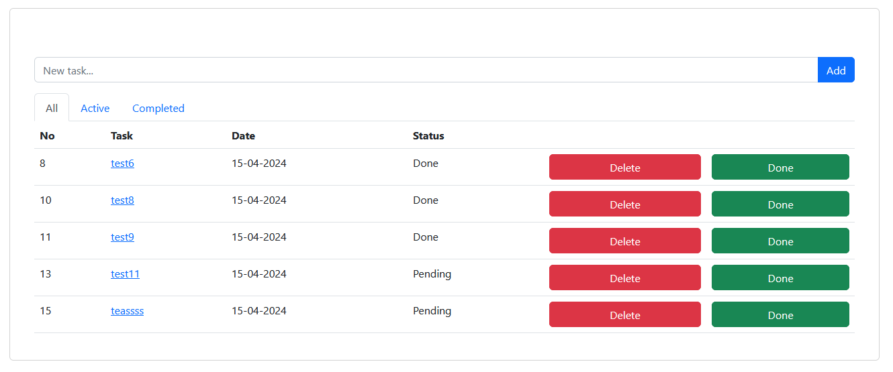
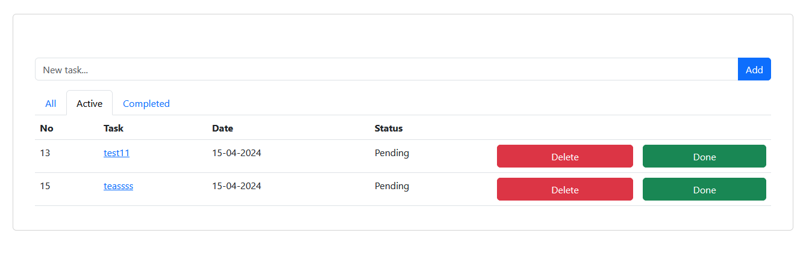
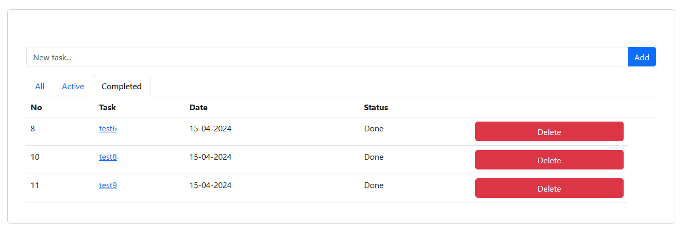
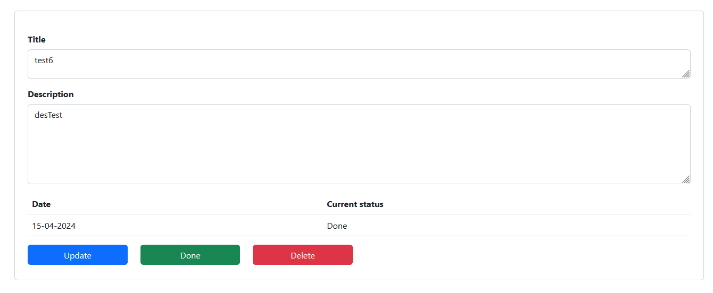
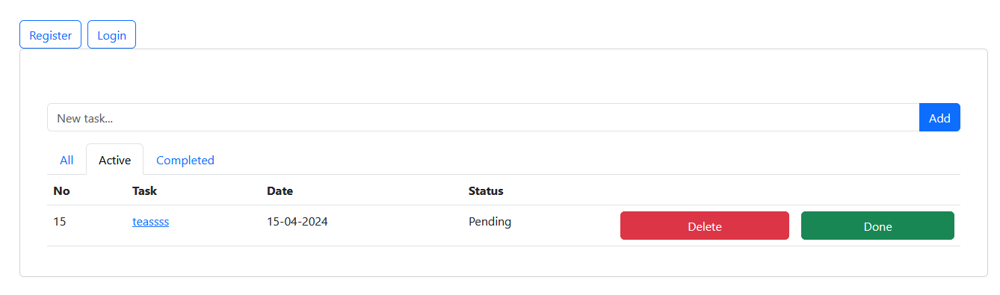
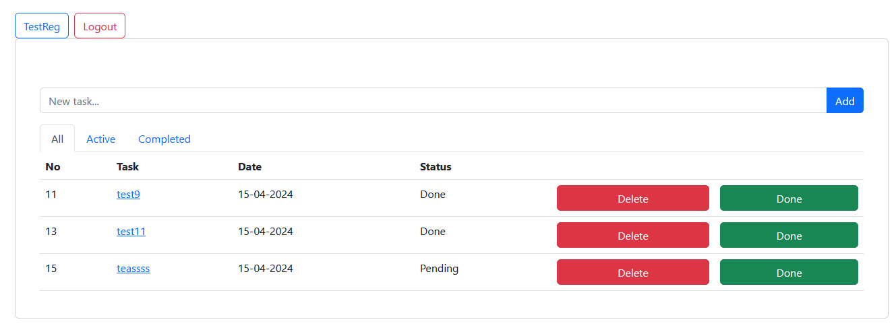
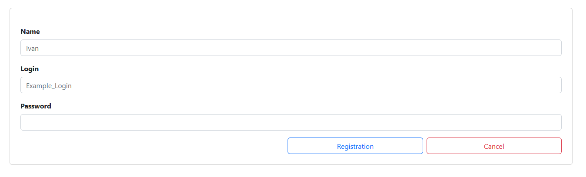
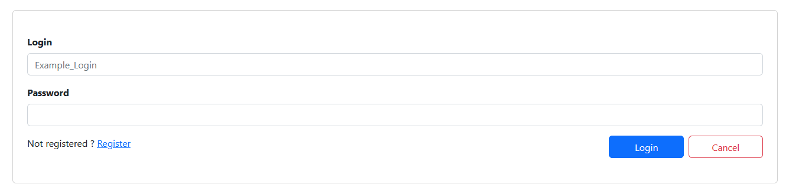

This web application is a simple version of Todo list.
User can add new tasks, delete and mark them as completed. 
User is unlimited in adding new tasks.
This app stores tasks in database and you can see all kinds of tasks on the main 
view in tabs such as: all / active / completed.
User can use todo as a guest or being logged in after signing up.

**Tech Stack:**
+ Java: JDK 17 for application, JDK 21 for the environment
+ Spring Framework: Spring Boot 2.7.6, Spring Core 
+ Database and ORM: Hibernate 5.6.11, PostgreSQL JDBC Driver 42.5.1
+ Database Migration: Liquibase 4.15.0
+ Testing: Mockito 4.0.0
+ Project Lombok: Lombok 1.18.30
+ Web Template Engine: Thymeleaf 3.0.15, Spring Boot Starter Thymeleaf
+ Frontend: Bootstrap 5.2.3, HTML, CSS
+ Logging: SLF4j 1.7.36

**Environment**
+ JDK 21
+ IntelliJ IDEA CE 2021.3.3 
+ Maven 3.8.1 
+ PostrgreSQL 15

**Main screen of the app**

**Screen of the only active tasks**

**Screen of the only completed tasks**

**Screen of the detailed description of the task and its modification**

**Screen when the user working as a guest**

**Screen when the user logged in**

**Screen of the registration page**

**Screen of the LogIn page**
